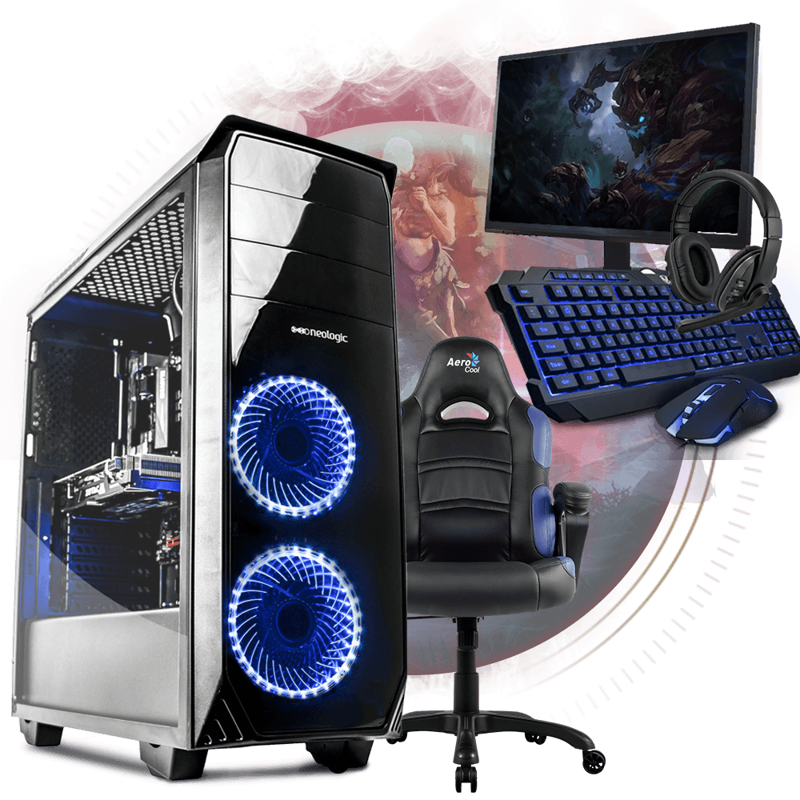

## SEJA BEM-VINDO AO MEU SITE

  

Meu nome é Joel, gosto de jogar jogos em computadores, não curto muito consoles. 
Assim que eu terminar o 2°, vou começar a fazer stream, porque é o que eu gosto, e assim que eu tiver um dinheiro, vou comprar um computador gamer.  
<h2>As configurações que eu desejo é:</h2> 
Processador - I7 8700 3.2GHz 
Placa Mãe - B360 (PORQUE TEM 4 SLOTS DE MEMORIA) 
Memoria RAM - 8GB DDR4 2400MHz  
Placa de vídeo - GIGABYTE GEFORCE RTX 2060 OC 6GB 
Memoria ROM - 1000GB HD SATA 3 6.0Gb/s 
Fonte - 500W 80 PLUS BRONZE GAMEMAX 
Gabinete - GAMEMAX ECO - LATERAL FULL WINDOW + 3 FAN 32 - LED VERDE 
Sistema Operacional - WINDOWS 10 PRO 64 BIT OEM 
Meu perfil na Cube TV: <a href="https://www.cube.tv/22814964">AQUI</a>   

<h3>Meu Pai é dono da FAZENDA CATTANI e lá é produzido:</h3> 
Banana; 
Limão; 
Caju; 
Goiaba; 

<h4>Veja algumas imagens:</h4> 
 
 

